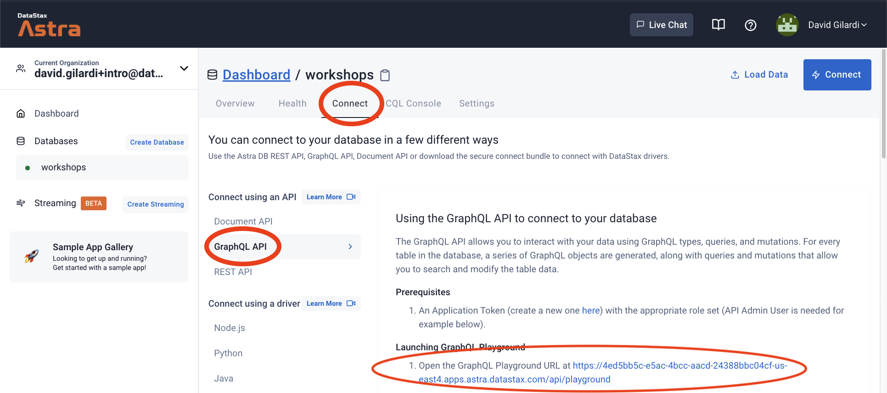

## 🎓🔥 Introduction to NoSQL Databases

[](http://www.apache.org/licenses/LICENSE-2.0)
[](https://discord.com/widget?id=685554030159593522&theme=dark)


These instructions will lead you step by step for the workshop on introducing the NoSQL Databases technologies.

## Materials for the Session

It doesn't matter if you join our workshop live or you prefer to do at your own pace, we have you covered. In this repository, you'll find everything you need for this workshop:

- [Workshop video](#)
- [Slide deck](./slides.pdf)
- [Discord chat](https://bit.ly/cassandra-workshop)
- [Questions and Answers](https://community.datastax.com/)

## Participation Badge / Homework

To get the verified badge, you have to complete the following steps:

1. Complete the practice steps of this workshop as explained below. Steps 1-4 (Astra account + tabular/document/key-value databases) are mandatory, step 5 (graph database) is optional. Take a screenshot of the last completed step for  steps 2, 3 and 4. _NOTE: When taking screenshots ensure NOT to copy your Astra DB secrets!_
<!-- x. Complete [try-it-out scenario](https://www.datastax.com/try-it-out) and make a screenshot of the "scenario completed" screen -->
2. Submit the practice [here](https://dtsx.io/nosql-ws-hw), answering test questions and attaching the screenshots.

## Practice

1. [Login or Register to AstraDB and create database](#1-login-or-register-to-astradb-and-create-database)
2. [Tabular Databases](#2-tabular-databases)
3. [Document Databases](#3-document-databases)
4. [Key-Value Databases](#4-keyvalue-databases)
5. [Graph Databases](#5-graph-databases)

## 1. Login or Register to AstraDB and create database

**`ASTRADB`** is the simplest way to run Cassandra with zero operations at all - just push the button and get your cluster. No credit card required,
a monthly free credit to use, covering about 20M reads/writes and 80GB storage (sufficient to run small production workloads), all for FREE.

✅ **Step 1a:** Click the button below to login or register with Datastax. You can use your `Github`, `Google` accounts or register with an `email`.

<a href="https://astra.dev/2-9"></a>

**Use the following values when creating the database** (this makes your life easier further on):

|Field| Value|
|---|---|
|**database name**| `workshops` |
|**keyspace**| `nosql1` |
|**Cloud Provider**| *Use the one you like, click a cloud provider logo, pick an Area in the list and finally pick a region.* |

More info on account creation [here](https://awesome-astra.github.io/docs/pages/astra/create-account/).

#### You will see your new database in `pending` or `initailizing` on the Dashboard.

The status will change to `Active` when the database is ready, this will only take 2-3 minutes. You will also receive an email when it is ready.

## 2. Tabular databases

In a tabular database we will store ... tables! The Astra DB Service is built on Apache Cassandra™, which is tabular. Let's start with this.

> **Tabular databases** organize data in rows and columns, but with a twist from the traditional RDBMS. Also known as wide-column stores or partitioned row stores, they provide the option to organize related rows in partitions that are stored together on the same replicas to allow fast queries. Unlike RDBMSs, the tabular format is not necessarily strict. For example, Apache Cassandra™ does not require all rows to contain values for all columns in the table. Like Key/Value and Document databases, Tabular databases use hashing to retrieve rows from the table. Examples include: Cassandra, HBase, and Google Bigtable.

**✅ 2a. Describe your Keyspace**

At Database creation you provided a keyspace, a logical grouping for tables.
Let's visualize it.
In Astra DB go to CQL Console to enter the following commands

- *Select your db*


- *Select CqlConsole*


- *Enter the command*
```sql
DESCRIBE KEYSPACES;
```


**✅ 2b. Create table**

- *Execute the following Cassandra Query Language commands:*

```sql
USE nosql1;

CREATE TABLE IF NOT EXISTS accounts_by_user (
  user_id         UUID,
  account_id      UUID,
  account_type    TEXT,
  account_balance DECIMAL,
  user_name       TEXT      STATIC,
  user_email      TEXT      STATIC,
  PRIMARY KEY ( (user_id), account_id)
)   WITH CLUSTERING ORDER BY (account_id ASC);
```

- *Visualize keyspace structure:*

```sql
DESCRIBE KEYSPACE nosql1;
```
**👁️ Expected output**

```
CREATE KEYSPACE nosql1 WITH replication = {'class': 'NetworkTopologyStrategy', 'eu-central-1': '3'}  AND durable_writes = true;

CREATE TABLE nosql1.accounts_by_user (
    user_id uuid,
    account_id uuid,
    account_balance decimal,
    account_type text,
    user_email text static,
    user_name text static,
    PRIMARY KEY (user_id, account_id)
) WITH CLUSTERING ORDER BY (account_id ASC)
    AND additional_write_policy = '99PERCENTILE'
    AND bloom_filter_fp_chance = 0.01
    AND caching = {'keys': 'ALL', 'rows_per_partition': 'NONE'}
    AND comment = ''
    AND compaction = {'class': 'org.apache.cassandra.db.compaction.UnifiedCompactionStrategy'}
    AND compression = {'chunk_length_in_kb': '64', 'class': 'org.apache.cassandra.io.compress.LZ4Compressor'}
    AND crc_check_chance = 1.0
    AND default_time_to_live = 0
    AND gc_grace_seconds = 864000
    AND max_index_interval = 2048
    AND memtable_flush_period_in_ms = 0
    AND min_index_interval = 128
    AND read_repair = 'BLOCKING'
    AND speculative_retry = '99PERCENTILE';
```

**✅ 2c. Working with DATA** :

- *Insert some entries into the table:*

```sql
INSERT INTO accounts_by_user(user_id, account_id, account_balance, account_type, user_email, user_name)
VALUES(
    1cafb6a4-396c-4da1-8180-83531b6a41e3,
    811b56c3-cead-40d9-9a3d-e230dcd64f2f,
    1500,
    'Savings',
    'Alice',
    'alice@example.org'
);

INSERT INTO accounts_by_user(user_id, account_id, account_balance, account_type)
VALUES(
    1cafb6a4-396c-4da1-8180-83531b6a41e3,
    83428a85-5c8f-4398-8019-918d6e1d3a93,
    2500,
    'Checking'
);

INSERT INTO accounts_by_user(user_id, account_id, account_balance, account_type, user_email, user_name)
VALUES(
    0d2b2319-9c0b-4ecb-8953-98687f6a99ce,
    81def5e2-84f4-4885-a920-1c14d2be3c20,
    1000,
    'Checking',
    'Bob',
    'bob@example.org'
);
```

- *Read values*

```sql
SELECT * FROM accounts_by_user;
```

**👁️ Expected output**

```
 user_id                              | account_id                           | user_email | user_name         | account_balance | account_type
--------------------------------------+--------------------------------------+------------+-------------------+-----------------+--------------
 0d2b2319-9c0b-4ecb-8953-98687f6a99ce | 81def5e2-84f4-4885-a920-1c14d2be3c20 |        Bob |   bob@example.org |            1000 |     Checking
 1cafb6a4-396c-4da1-8180-83531b6a41e3 | 811b56c3-cead-40d9-9a3d-e230dcd64f2f |      Alice | alice@example.org |            1500 |      Savings
 1cafb6a4-396c-4da1-8180-83531b6a41e3 | 83428a85-5c8f-4398-8019-918d6e1d3a93 |      Alice | alice@example.org |            2500 |     Checking

(3 rows)
```

> Notice that all three rows are "filled with data", despite the second of the insertions above skipping the `user_email` and `user_name` columns:
> this is because these are **static columns** (i.e. associated to the whole partition) and in this case their value had been written already.

- *Read by primary key*

```sql
SELECT user_email, account_type, account_balance
  FROM accounts_by_user
  WHERE user_id=0d2b2319-9c0b-4ecb-8953-98687f6a99ce
    AND account_id=81def5e2-84f4-4885-a920-1c14d2be3c20;
```

**👁️ Expected output**

```
 user_email | account_type | account_balance
------------+--------------+-----------------
        Bob |     Checking |            1000

(1 rows)
```

**✅ 2d. Working with PARTITIONS** :

But data can be grouped, we stored together what should be retrieved together.

- *Try a query not compatible with the data model* 

</details><summary>(Optional: click to expand)</summary>

```
SELECT account_id, account_type, account_balance
   FROM accounts_by_user
   WHERE account_id=81def5e2-84f4-4885-a920-1c14d2be3c20;
```

<!-- ```
InvalidRequest: Error from server: code=2200 [Invalid query] message="Cannot execute this query as it might involve data filtering and thus may have unpredictable performance. If you want to execute this query despite the performance unpredictability, use ALLOW FILTERING"
```
 -->

**`Yes, we know`**, and now let's see why.

```
TRACING ON;
SELECT account_id, account_type, account_balance
   FROM accounts_by_user
   WHERE account_id=81def5e2-84f4-4885-a920-1c14d2be3c20
   ALLOW FILTERING;
TRACING OFF;
```

> _Note_: `ALLOW FILTERING` is almost never to be used in production, we use it here to see what happens!

**👁️ Output**

```
 account_id                           | account_type | account_balance
--------------------------------------+--------------+-----------------
 81def5e2-84f4-4885-a920-1c14d2be3c20 |     Checking |            1000

(1 rows)
```

But also (_"Anatomy of a full-cluster scan"_):

```
Tracing session: e97b98b0-d146-11ec-a4e5-19251c2b96e1

 activity                                                                                                                   | timestamp                  | source      | source_elapsed | client
----------------------------------------------------------------------------------------------------------------------------+----------------------------+-------------+----------------+-----------------------------------------
                                                                                                         Execute CQL3 query | 2022-05-11 16:25:03.675000 | 10.0.63.218 |              0 | 2898:d2d9:30d9:4a4f:acec:3e3a:3a76:4a7b
 Parsing SELECT[....]_by_user\n   WHERE account_id=81def5e2-84f4-4885-a920-1c14d2be3c20\n   ALLOW FILTERING; [CoreThread-0] | 2022-05-11 16:25:03.676000 | 10.0.63.218 |            229 | 2898:d2d9:30d9:4a4f:acec:3e3a:3a76:4a7b
                                                                                         Preparing statement [CoreThread-0] | 2022-05-11 16:25:03.676000 | 10.0.63.218 |            445 | 2898:d2d9:30d9:4a4f:acec:3e3a:3a76:4a7b
                                                                                Computing ranges to query... [CoreThread-0] | 2022-05-11 16:25:03.681000 | 10.0.63.218 |           5970 | 2898:d2d9:30d9:4a4f:acec:3e3a:3a76:4a7b
                                                         READS.RANGE_READ message received from /10.0.63.218 [CoreThread-9] | 2022-05-11 16:25:03.682000 | 10.0.31.189 |             -- | 2898:d2d9:30d9:4a4f:acec:3e3a:3a76:4a7b
                Submitting range requests on 25 ranges with a concurrency of 1 (0.0 rows per range expected) [CoreThread-0] | 2022-05-11 16:25:03.682000 | 10.0.63.218 |           6197 | 2898:d2d9:30d9:4a4f:acec:3e3a:3a76:4a7b
                                                                       Submitted 1 concurrent range requests [CoreThread-0] | 2022-05-11 16:25:03.682000 | 10.0.63.218 |           6312 | 2898:d2d9:30d9:4a4f:acec:3e3a:3a76:4a7b
                                             Sending READS.RANGE_READ message to /10.0.32.75, size=227 bytes [CoreThread-9] | 2022-05-11 16:25:03.682000 | 10.0.63.218 |           6436 | 2898:d2d9:30d9:4a4f:acec:3e3a:3a76:4a7b
                                            Sending READS.RANGE_READ message to /10.0.31.189, size=227 bytes [CoreThread-8] | 2022-05-11 16:25:03.682000 | 10.0.63.218 |           6436 | 2898:d2d9:30d9:4a4f:acec:3e3a:3a76:4a7b
                                                         READS.RANGE_READ message received from /10.0.63.218 [CoreThread-4] | 2022-05-11 16:25:03.683000 |  10.0.32.75 |             -- | 2898:d2d9:30d9:4a4f:acec:3e3a:3a76:4a7b
             Executing seq scan across 0 sstables for (min(-9223372036854775808), min(-9223372036854775808)] [CoreThread-4] | 2022-05-11 16:25:03.683000 |  10.0.32.75 |            444 | 2898:d2d9:30d9:4a4f:acec:3e3a:3a76:4a7b
             Executing seq scan across 0 sstables for (min(-9223372036854775808), min(-9223372036854775808)] [CoreThread-9] | 2022-05-11 16:25:03.684000 | 10.0.31.189 |            356 | 2898:d2d9:30d9:4a4f:acec:3e3a:3a76:4a7b
                                                                       Read 1 live rows and 0 tombstone ones [CoreThread-4] | 2022-05-11 16:25:03.684000 |  10.0.32.75 |            789 | 2898:d2d9:30d9:4a4f:acec:3e3a:3a76:4a7b
                                                                       Read 1 live rows and 0 tombstone ones [CoreThread-9] | 2022-05-11 16:25:03.684000 | 10.0.31.189 |            731 | 2898:d2d9:30d9:4a4f:acec:3e3a:3a76:4a7b
                                                          Enqueuing READS.RANGE_READ response to /10.0.32.75 [CoreThread-4] | 2022-05-11 16:25:03.684000 |  10.0.32.75 |            897 | 2898:d2d9:30d9:4a4f:acec:3e3a:3a76:4a7b
                                                         Enqueuing READS.RANGE_READ response to /10.0.31.189 [CoreThread-9] | 2022-05-11 16:25:03.684000 | 10.0.31.189 |            731 | 2898:d2d9:30d9:4a4f:acec:3e3a:3a76:4a7b
                                            Sending READS.RANGE_READ message to /10.0.63.218, size=212 bytes [CoreThread-7] | 2022-05-11 16:25:03.684000 |  10.0.32.75 |            954 | 2898:d2d9:30d9:4a4f:acec:3e3a:3a76:4a7b
                                            Sending READS.RANGE_READ message to /10.0.63.218, size=212 bytes [CoreThread-1] | 2022-05-11 16:25:03.684000 | 10.0.31.189 |           1098 | 2898:d2d9:30d9:4a4f:acec:3e3a:3a76:4a7b
                                                          READS.RANGE_READ message received from /10.0.32.75 [CoreThread-9] | 2022-05-11 16:25:03.685000 | 10.0.63.218 |           9626 | 2898:d2d9:30d9:4a4f:acec:3e3a:3a76:4a7b
                                                         READS.RANGE_READ message received from /10.0.31.189 [CoreThread-1] | 2022-05-11 16:25:03.702000 | 10.0.63.218 |          27526 | 2898:d2d9:30d9:4a4f:acec:3e3a:3a76:4a7b
                                                                        Processing response from /10.0.32.75 [CoreThread-0] | 2022-05-11 16:25:03.856000 | 10.0.63.218 |         181075 | 2898:d2d9:30d9:4a4f:acec:3e3a:3a76:4a7b
                                                                       Processing response from /10.0.31.189 [CoreThread-0] | 2022-05-11 16:25:03.856000 | 10.0.63.218 |         181193 | 2898:d2d9:30d9:4a4f:acec:3e3a:3a76:4a7b
Didn't get enough response rows; actual rows per range: 0.04; remaining rows: 99, new concurrent requests: 1 [CoreThread-0] | 2022-05-11 16:25:03.856000 | 10.0.63.218 |         181384 | 2898:d2d9:30d9:4a4f:acec:3e3a:3a76:4a7b
                                                                                                           Request complete | 2022-05-11 16:25:03.856560 | 10.0.63.218 |         181560 | 2898:d2d9:30d9:4a4f:acec:3e3a:3a76:4a7b
```

</details>

- *Retrieve data from a whole partition*

```sql
SELECT account_id, account_type, account_balance
  FROM accounts_by_user
  WHERE user_id=1cafb6a4-396c-4da1-8180-83531b6a41e3;
```

**👁️ Expected output**

```
 account_id                           | account_type | account_balance
--------------------------------------+--------------+-----------------
 811b56c3-cead-40d9-9a3d-e230dcd64f2f |      Savings |            1500
 83428a85-5c8f-4398-8019-918d6e1d3a93 |     Checking |            2500

(2 rows)
```

[🏠 Back to Table of Contents](#table-of-content)

## 3. Document Databases

Let's do some hands-on with document database queries.

> **Document databases** expand on the basic idea of key-value stores where “documents” are more complex, in that they contain data and each document is assigned a unique key, which is used to retrieve the document. These are designed for storing, retrieving, and managing document-oriented information, often stored as JSON. Since the Document database can inspect the document contents, the database can perform some additional retrieval processing. Unlike RDBMSs which require a static schema, Document databases have a flexible schema as defined by the document contents. Examples include: MongoDB and CouchDB. Note that some RDBMS and NoSQL databases outside of pure document stores are able to store and query JSON documents, including Cassandra.

**✅ 3a. Cassandra knows JSON** :

It is not a known fact but Cassandra accepts JSON query out of the box. You can find more information [here](https://docs.datastax.com/en/cql-oss/3.3/cql/cql_using/useInsertJSON.html).

- *Insert data into Cassandra with JSON*

```sql
INSERT INTO videos JSON '{
   "videoid":"e466f561-4ea4-4eb7-8dcc-126e0fbfd578",
     "email":"clunven@sample.com",
     "title":"A JSON videos",
     "upload":"2020-02-26 15:09:22 +00:00",
     "url": "http://google.fr",
     "frames": [1,2,3,4],
     "tags":   [ "cassandra","accelerate", "2020"]
}';
```

In the same way you can retrieve JSON out of Cassandra ([more info here](https://docs.datastax.com/en/cql-oss/3.3/cql/cql_using/useQueryJSON.html)).

- *Retrieve data from Cassandra as JSON*

```sql
select json title,url,tags from videos;
```


**✅ 3b. Create your Application token** :

You need to create an Astra DB token, which will be used to interact with the
database through the Swagger UI. Once created, store its value in a safe place
(the Astra console won't show that to you again!) and do not post it in public.

To create the token from your main dashboard (where your databases are listed)
simply click on the "..." menu next to your database and choose "Generate a token".
Choose the role "Database Administrator" and click on "Generate Token".

_Alternatively, go to the Astra dashboard, open the Organization menu on the
top left and choose "Organization settings", then "Token Management" and finally
you will be able to generate a new token. Choose the role "Database Administrator"._

Download the token in CSV format and/or copy
its value to a handy place such as a text editor: we will use it immediately!

_See this [documentation](https://docs.datastax.com/en/astra/docs/manage-application-tokens.html) to create your application token._ 

*The Astra DB Token looks like the following (do not copy, it's just an example)*
```
AstraCS:KDfdKeNREyWQvDpDrBqwBsUB:ec80667c....
```

**👁️ Walkthrough**

Quick way:

)

This is what the token page looks like:


**Swagger UI**

Next go the "Connect" page, locate the SWAGGER URL


Locate the "documents" section in the Swagger UI.


**✅ 3c Create a new empty collection** :


- Access ***Create a new empty collection in a namespace***
- Click `Try it out` button
- Fill Header `X-Cassandra-Token` with `<your_token>`
- For `namespace-id` use `nosql1`
- For `body` use 

```json
{ "name": "col1" }
```
- Click `Execute` button

You will get an _"HTTP 201 - Created"_ return code

**✅ 3d. Create a new document** :


- Access ***Create a new document***
- Click `Try it out` button
- Fill with Header `X-Cassandra-Token` with `<your_token>`
- For `namespace-id` use `nosql1`
- For `collection-id` use `col1`
- For `body` use 

```json
{
    "videoid":"e466f561-4ea4-4eb7-8dcc-126e0fbfd573",
    "email":"clunven@sample.com",
    "title":"A Second video",
    "upload":"2020-02-26 15:09:22 +00:00",
    "url": "http://google.fr",
    "frames": [1,2,3,4],
    "tags":   [ "cassandra","accelerate", "2020"],
    "formats": { 
       "mp4": {"width":1,"height":1},
       "ogg": {"width":1,"height":1}
    }
}
```
- Click `Execute` button

*👁️ Expected output*
```json
{
  "documentId":"5d746e40-97cf-490b-ab0d-68cfbc5d2ef3"
}
```

You can add a couple of documents changing values, new documents with new ids will be generated

**✅ 3e Find all documents of a collection** :


- Access ***Search documents in a collection***
- Click `Try it out` button
- Fill Header `X-Cassandra-Token` with `<your_token>`
- For `namespace-id` use `nosql1`
- For `collection-id` use `col1`

Let other fields blank every query is paged in Cassandra.

- Click `Execute` button

**👁️ Expected output**:
```json
{
  "data": {
    "84bd6ebc-a274-4dc3-ae7c-eb2fd913331b": {
      "email": "clunven@sample.com",
      "formats": {
        "mp4": {
          "height": 1,
          "width": 1
        },
        "ogg": {
          "height": 1,
          "width": 1
        }
      },
      "frames": [
        1,
        2,
        3,
        4
        ...
```

**✅ 3f Retrieve a document from its id** :


- Access ***Get a document***
- Click `Try it out` button
- Fill Header `X-Cassandra-Token` with `<your_token>`
- For `namespace-id` use `nosql1`
- For `collection-id` use `col1`
- For `document-id` use `<doc_id_in_previous_call>`
- Click `Execute` button

**👁️ Expected output**:
```json
{
  "documentId": "84bd6ebc-a274-4dc3-ae7c-eb2fd913331b",
  "data": {
    "email": "clunven@sample.com",
    "formats": {
      "mp4": {
        "height": 1,
        "width": 1
      },
      "ogg": {
        "height": 1,
        "width": 1
      }
    },
    "frames": [
      1,
      2,
      3,
      4
    ],
    "tags": [
      "cassandra",
      "accelerate",
      "2020"
    ],
    "title": "A Second videos",
    "upload": "2020-02-26 15:09:22 +00:00",
    "url": "http://google.fr",
    "videoid": "e466f561-4ea4-4eb7-8dcc-126e0fbfd573"
  }
}
```

**✅ 3g Search document from a where clause** :


- Access ***Search documents in a collection***
- Click `Try it out` button
- Fill Header `X-Cassandra-Token` with `<your_token>`
- For `namespace-id` use `nosql1`
- For `collection-id` use `col1`
- For `where` use `{"email":    { "$eq":"clunven@sample.com" } } `
- Click `Execute` button

*👁️ Expected output*
```json
{
  "data": {
    "84bd6ebc-a274-4dc3-ae7c-eb2fd913331b": {
      "email": "clunven@sample.com",
      "formats": {
        "mp4": {
          "height": 1,
          "width": 1
        },
        "ogg": {
          "height": 1,
          "width": 1
        }
      },
      "frames": [
        1,
        2,
        3,
        4
      ],
      "tags": [
        "cassandra",
        "accelerate",
        "2020"
      ],
      "title": "A Second videos",
      "upload": "2020-02-26 15:09:22 +00:00",
      "url": "http://google.fr",
      "videoid": "e466f561-4ea4-4eb7-8dcc-126e0fbfd573"
    }
  }
}
```

[🏠 Back to Table of Contents](#table-of-content)

## 4. Key/Value Databases

> **Key/Value databases** are some of the simplest and yet powerful as all of the data within consists of an indexed key and a value. Key-value databases use a hashing mechanism such that given a key, the database can quickly retrieve an associated value. Hashing mechanisms provide constant time access, which means they maintain high performance even at large scale. The keys can be any type of object, but are typically a string. The values are generally opaque blobs (i.e., a sequence of bytes that the database does not interpret). Examples include: Redis, Amazon DynamoDB, Riak, and Oracle NoSQL database. Some tabular NoSQL databases, like Cassandra, can also service key/value needs.

**✅ 4b. Create a table with GraphQL**

Navigate to the GraphQL playground, by clicking `Connect`, then `GraphQL API`, and finally you should see the URL under `Launching GraphQL Playground`. Ctrl-click or right-click the link to launch into a new tab.



Then you need to enter in your Astra DB token to authenticate and talk to the database. Notice the "server cannot be reached" message. This is simply telling you it cannot make the connection because you are not authenticated. Click on `HTTP Headers` at the bottom and paste in your token.


Paste in your token.


Now you are ready to go.

Use this query. Since we are creating a table we want to use the `graphql-schema` tab

```
mutation {
  kv: createTable(
    keyspaceName:"nosql1",
    tableName:"key_value",
    partitionKeys: [ # The keys required to access your data
      { name: "key", type: {basic: TEXT} }
    ]
    values: [ # The values associated with the keys
      { name: "value", type: {basic: TEXT} }
    ]
  )
}
```


You can check in the CQL Console as well;

```sql
use nosql1;

describe table key_value;
```

*Expected output*


**✅ 4c. Populate the table**

Any of the created APIs can be used to interact with the GraphQL data, to write or read data. Since we are working with data now and not creating schema you will need to **swtich to the `graphql` tab**. Also, make sure you **fill in your Astra DB token again**.

- *Fill the header token again*

```json
{
  "x-cassandra-token":"AstraCS:KDfdKeNREyWQvDpDrBqwBsUB:ec80667c...."
}
```


Now, let’s navigate to your new keyspace `nosql1` inside the playground. **Change tab to `graphql`** and pick url `/graphql/nosql1`. Your URL should end with something like `/api/graphql/nosql1`. If you have trouble ensuring this, switch back to the `graphql-schema` tab to grab the URL and applying some surgery on it to use the end point that includes `graphql` aand the keyspace `nosql1` so that it ends with `/api/graphql/nosql1` as explained earlier.


Then paste in the following query and click "play". 


- *Execute this query*

```
mutation insert2KV {
  key1: insertkey_value(value: {key:"key1", value:"bbbb"}) {
    value {
      key,value
    }
  }
  key2: insertkey_value(value: {key:"key2", value:"bbbb"}) {
    value {
      key,value
    }
  }
}
```

- Check with CQL Console

```sql
select * from key_value;
```

*Expected output:*


- *Execute this query*

```
mutation insert2KV {
  key1: insertkey_value(value: {key:"key1", value:"cccc"}) {
    value {
      key,value
    }
  }
}
```

- Check with CQL Console the values should have been updated. Indeed with Cassandra there are no integrity constraints, so you can de-duplicate values easily.

[🏠 Back to Table of Contents](#table-of-content)

## 5. Graph Databases

> **Graph databases** store their data using a graph metaphor to exploit the relationships between data. Nodes in the graph represent data items, and edges represent the relationships between the data items. Graph databases are designed for highly complex and connected data, which outpaces the relationship and JOIN capabilities of an RDBMS. Graph databases are often exceptionally good at finding commonalities and anomalies among large data sets. Examples of Graph databases include DataStax Graph, Neo4J, JanusGraph, and Amazon Neptune.

Astra DB does not contain yet a way to implement Graph Databases use cases. But at Datastax we do have a product called [DataStax Graph](https://www.datastax.com/products/datastax-graph) that you can use for free when not in production.

For graph databases, the presenter will show a demo based on the example in the slides.

The hands-on practice for you is different. But since it cannot be done in the browser using
Astra DB like the rest, it is kept separate and not included in today's curriculum.

🔥 Yet, you are strongly encouraged to try it at your own pace, on your own computer,
by following the instructions given here: [Graph Databases Practice](graph_databases.md). 🔥

> Try it out, it's super cool!

## THE END

Congratulations! You made it to the END.

See you next time!

[🏠 Back to Table of Contents](#table-of-content)
